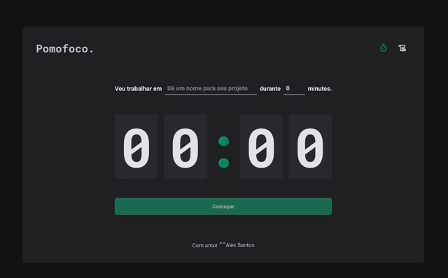
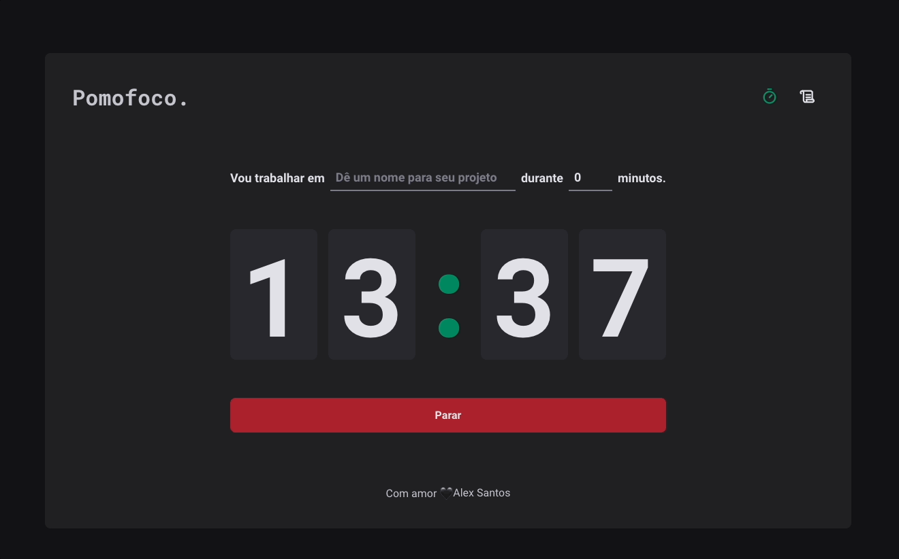

<h1 align="center">Pomofoco - App de Pomodoro Timer</h1>

Criação de uma aplicação de um Pomodoro Timer no qual utilizo todos os dias para trabalhar e estudar

<h2 align="center">O que é Pomodoro?</h2>

A Técnica Pomodoro é um método de gerenciamento de tempo desenvolvido por Francesco Cirillo no final dos anos 1980. A técnica consiste na utilização de um cronômetro para dividir o trabalho em períodos de 25 minutos, separados por breves intervalos.

  <h3> 🚀 Publicado 🚀 </h3>
  <strong><a href="https://pomofoco.vercel.app/" target="_blank">🔗 Visualize o projeto clicando aqui</a></strong>

# Sumário
-[Funcionalidades](#funcionalidades)  
-[Imagens](#imagens) 
-[Tecnologias](#tecnologias) 

# Funcionalidades
- [x] Criação da sessão pomodoro de até 60 minutos
- [x] Definir o título da sessão do pomodoro
- [x] Histórico de sessões e seus detalhes e status
- [x] Armazenamento de histórico das sessões no Local Storage do navegador
- [X] Sugestão de Título ao criar sessão
- [ ] Responsividade para o mobile

# Imagens

# Tecnologias
As ferramentas utilizadas foram:
<ul style="list-style: none">
  <li>React com o Vite</li>
  <li>Typescript</li>
  <li>React Hook Form</li>
  <li>Date FNS</li>
  <li>Phosphor Icons</li>
  <li>React Router</li>
  <li>Styled Components</li>
  <li>Zod</li>
  <li>Immer</li>
</ul>

  <h3> 🚀 Publicado 🚀 </h3>
  <strong><a href="https://pomofoco.vercel.app/" target="_blank">🔗 Visualize o projeto clicando aqui</a></strong>

# Autor

<a href="https://github.com/devalexsantos">Alex Santos</a>

